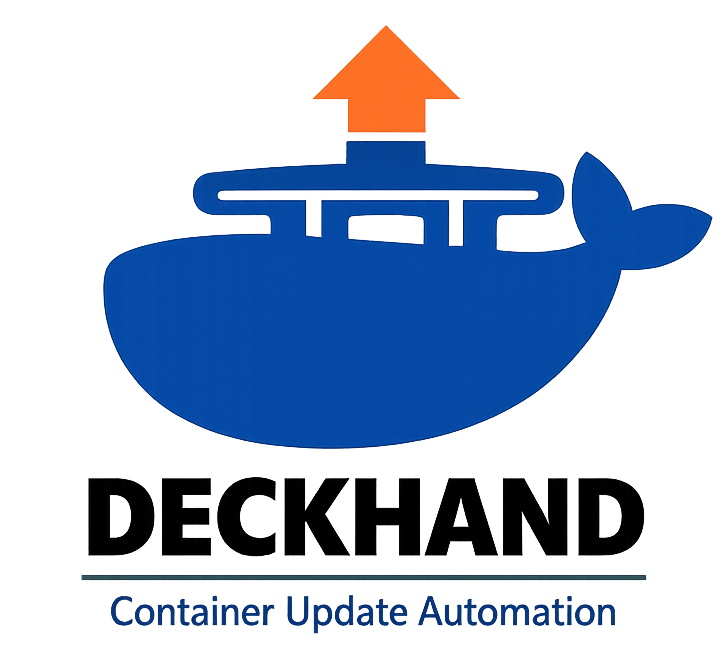
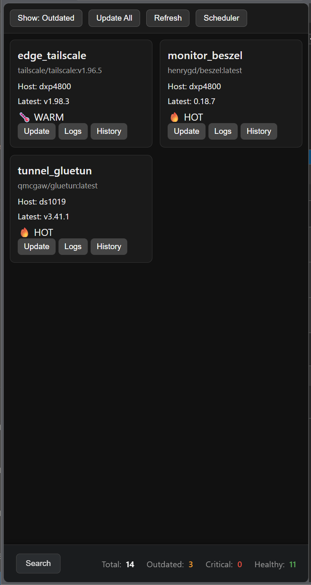
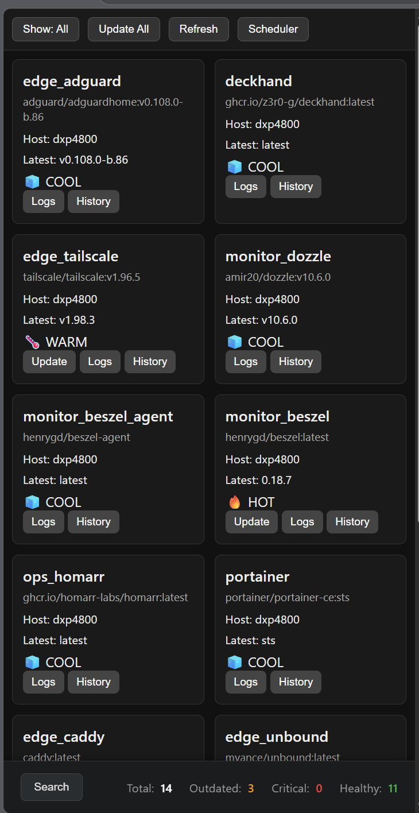

# 🛳️ Deckhand

### *Agentless Container Update Intelligence for Portainer*

Deckhand is a modern, lightweight, agentless replacement for **DIUN** and **Watchtower**, designed for homelab and small‑scale container environments that use **Portainer** for orchestration and want a simple unified dashboard widget that is responsive to scaling.

Instead of automatically updating containers like Watchtower, Deckhand provides **intelligent monitoring**, **version awareness**, **CVE scoring**, and **manual or scheduled update controls** directly from any iFrame capable Dashboard UI (but designed specifically for iFrame embedding Portainer Update Manager in Homarr).

---

## 🚀 Features

### 🔍 **Agentless Container Discovery**
Deckhand connects directly to the **Portainer API** to discover:

- Containers  
- Stacks  
- Image tags  
- Image digests  
- Registry credentials  
- Endpoint metadata  

No sidecars, no host agents, no Docker socket mounts.

---

### 🏷️ **Registry Polling (DIUN Replacement)**
Deckhand polls container registries to detect:

- New tags  
- New digests  
- Semantic version changes  
- Patch/minor/major deltas  
- Deprecated or removed tags  

Supports:

- Docker Hub  
- GHCR  
- Private Registries (via Portainer Auth)

---

### 🛡️ **CVE‑Aware Intelligence**
Deckhand optionally integrates with **Trivy** to scan images and extract:

- Highest CVE severity  
- Critical CVE count  
- Patched version (if available)  
- Vulnerability metadata  

CVE data is merged with version delta to determine severity.

---

### 🎨 **Heat-Based Update Status**

Deckhand uses an intuitive "heat" system to indicate update urgency. The UI supports two modes:

**Professional Mode:**
| Heat | Meaning | Icon | Condition |
|------|---------|------|-----------|
| 0 | Up to date | ✔️ | No updates available |
| 1 | Patch available | ⬆️ | Patch version update |
| 2 | Minor available | 🔧 | Minor version update |
| 3 | Major available | ⚠️ | Major version update |
| 4 | Critical | 🔥 | Critical update or vulnerabilities |

**Fun Mode:**
| Heat | Meaning | Icon | Condition |
|------|---------|------|-----------|
| 0 | Cool | 🧊 | Chillin' (up to date) |
| 1 | Warm | 🌡️ | A little spicy (patch) |
| 2 | Hot | 🔥 | Getting toasty (minor) |
| 3 | Burning | ⚠️🔥 | This is fine 🔥🐶 (major) |
| 4 | Streaming | 🌋 | Meltdown imminent (critical) |

---

### 🧭 **UI Controls**
Deckhand exposes a clean, responsive UI:

- **Update Now** — Immediately pull and deploy the latest image  
- **View Version History** — See all previous updates  
- **Show/Hide Updates** — Filter to only show containers with updates  
- **Refresh** — Force a registry scan  
- **Scheduler** — Configure automatic updates (Phase 1+)  

All actions are performed through Deckhand’s API and executed via Portainer.

---

### 🔧 **Portainer‑Driven Updates (Watchtower Replacement)**
Deckhand performs updates using the Portainer API:

- Pull new image  
- Recreate container  
- Redeploy stack  
- Restart services  
- Log update events  

Deckhand never mutates your system without your explicit approval.

---

### 🕒 **Built‑In Scheduler**
Deckhand includes a flexible scheduler supporting:

- Interval-based automatic updates  
- Skip lists (per-container)  
- Event logging  

Advanced cron expressions and CVE-triggered updates are planned for Phase 2+.

---

### 📦 **Lightweight & Self‑Contained**
Deckhand runs as a single container:

- Flask backend  
- SQLite WAL database  
- Zero agents  
- Zero sidecars  

---

## 📸 Screenshots

|  |  |
|:---:|:---:|
| *Default View* | *Unfiltered View* |


---

## � UI Overview

### `GET /health`
JSON Health Check:

```json
{
  "service": "deckhand",
  "status": "ok"
}
```

### `GET /`
Scalable User Interface, intended to be iFramed into Homarr or any other dashboard until that platform supports direct integration with the API.

---

## 📚 API Overview

### `GET /api/hosts`
List Portainer host endpoints.

### `GET /api/containers`
Return all containers from Portainer.

### `POST /api/containers/scan`
Force a full registry + CVE scan.

### `GET /api/status`
Return all containers with status, version delta, and CVE data.

### `POST /api/containers/{id}/update`
Trigger a Portainer‑managed (Watchtower-style) update flow for a single container by ID (full or prefix).

Query Param:
`endpoint_id` (optional) - to restrict search to specific host

### `GET /api/containers/status`
Dashboard friendly flattened status feed.

### TODO: `POST /api/containers/{id}/schedule`
Create or modify an update schedule.

### TODO: `POST /api/containers/{id}/ignore`
Ignore a specific version.


---
## 🗄️ Database Schema

Deckhand uses a lightweight, high‑performance SQLite database (WAL mode) to store container metadata, CVE results, schedules, and event history.

### `containers`
Tracks the current state of every discovered container across all Portainer endpoints.

| Column | Type | Description |
|:---|:---|:---|
| `id` | INTEGER | PRIMARY KEY |
| `host` | TEXT | Portainer endpoint name or ID |
| `container_name` | TEXT | Name of the discovered container |
| `image_repo` | TEXT | e.g. "linuxserver/sonarr" |
| `current_tag` | TEXT | Tag currently deployed |
| `latest_tag` | TEXT | Latest tag detected in registry |
| `digest_current` | TEXT | Digest of deployed image |
| `digest_latest` | TEXT | Digest of latest image |
| `version_delta` | INTEGER | Semantic version difference |
| `cve_score` | REAL | Highest CVE severity |
| `cve_count` | INTEGER | Number of critical CVEs |
| `status` | TEXT | green \| warning \| urgent |
| `last_seen` | DATETIME | Timestamp of last discovery |
| `last_updated` | DATETIME | Last time container was updated |

---

### `events`
Audit log of all actions and detections performed by Deckhand.

| Column | Type | Description |
|:---|:---|:---|
| `id` | INTEGER | PRIMARY KEY |
| `container_id` | INTEGER | ID of the container |
| `event_type` | TEXT | `update_detected`, `cve_detected`, `update_executed` |
| `payload` | TEXT | JSON blob with event details |
| `timestamp` | DATETIME | Timestamp of the event |

---

### `schedules`
Stores user‑defined update schedules for containers.

| Column | Type | Description |
|:---|:---|:---|
| `id` | INTEGER | PRIMARY KEY |
| `container_id` | INTEGER | ID of the container |
| `cron_expression` | TEXT | Cron expression for updates |
| `enabled` | BOOLEAN | Whether the schedule is active |
| `created_at` | DATETIME | Creation timestamp |


---

## 🛠️ Installation

### Prerequisites

- **Docker** & **Docker Compose** (because why else do you want this project?)
- **Portainer** 2.0+ (Deckhand relies on a Portainer API Key to operate, which is created in Portainer UI, under 'My Account' → 'Access Tokens' (example: `https://portainer:9000/#!/account`)

### Quick Start (Docker Compose)
```yaml
services:
  deckhand:
    image: ghcr.io/z3r0-g/deckhand:latest
    container_name: deckhand
    restart: unless-stopped
    ports:
      - "5000:5000"
    volumes:
      - deckhand-db:/app
    environment:
      - FLASK_ENV=production
      - PORTAINER_URL=https://your-portainer-host:9000
      - PORTAINER_API_KEY=ptr_your_api_key_here
      - DECKHAND_UI_MODE=fun
      - DATABASE_PATH=/app/deckhand.db
    security_opt:
      - no-new-privileges:true
    healthcheck:
      test: ["CMD", "wget", "--quiet", "--tries=1", "--spider", "http://localhost:5000/health"]
      interval: 30s
      timeout: 10s
      retries: 3
      start_period: 5s

volumes:
  deckhand-db:
    driver: local
```

**Steps:**
1. Open Portainer → Stacks → Add Stack
2. Paste the YAML above
3. Fill in your `PORTAINER_URL` and `PORTAINER_API_KEY`
4. Name it `deckhand` and deploy
5. Access at `http://<your-docker-host>:5000`

### Embedding in Homarr

Deckhand is designed for iframe embedding:

```html
<iframe
  src="http://deckhand:5000"
  style="width: 100%; height: 600px; border: none; border-radius: 8px;"
/>
```

In **Homarr**, add a custom HTML widget with the above code.

---

---

## ⚙️ Configuration

All configuration is managed via **environment variables** (see `.env.example` for defaults).

### Required Environment Variables

| Variable | Description | Example |
|----------|-------------|---------|
| `PORTAINER_URL` | Portainer API endpoint | `https://portainer.example.com:9000` |
| `PORTAINER_API_KEY` | Portainer API key (from UI Settings) | `ptr_xxxxx...` |

### Optional Environment Variables

| Variable | Default | Description |
|----------|---------|-------------|
| `DECKHAND_UI_MODE` | `fun` | UI theme (`fun` or `minimal`) |
| `DATABASE_PATH` | `deckhand.db` | SQLite database location |
| `SECRET_KEY` | `dev-key-change-in-production` | Flask session key (change in production) |
| `FLASK_ENV` | `production` | Flask environment |

### Development

For local development:
**Note:** This project requires **Python 3.14+**.
```bash
# Create virtual environment
python -m venv .venv
source .venv/bin/activate  # Linux/macOS
# or
.venv\Scripts\activate  # Windows

# Install dependencies
pip install -r requirements.txt

# Set environment variables
export PORTAINER_URL="https://your-portainer:9000"
export PORTAINER_API_KEY="ptr_your_key"

# Run locally
python app.py
# Open http://localhost:5000
```

---

## 🗺️ Registry Support

Deckhand auto-detects and polls the following registries without additional configuration:

### Automatically Supported Container Registries

| Registry | Example Image | Notes |
|----------|-------|-------|
| **Docker Hub** | `linuxserver/nginx:latest` | Public & private (via Portainer auth) |
| **GHCR** (GitHub) | `ghcr.io/z3r0-g/deckhand:latest` | Public & private (via token) |
| **lscr.io** (LinuxServer) | `lscr.io/linuxserver/nginx:latest` | Rolling tags aware |
| **Private Registries** | `registry.example.com:5000/myapp:v1.0` | Self-signed certs OK |

### Registry Detection Logic

Deckhand automatically detects registries by image prefix:

- Images with `ghcr.io/` → polled via **GHCR API**
- Images with `lscr.io/` → polled via **LinuxServer API** (rolling-tag safe)
- Images with custom domain (e.g., `registry.example.com/`) → polled via **Private Registry API**
- Plain images (e.g., `linuxserver/nginx`) → polled via **Docker Hub API**

### Using GHCR Images

To use images from **GitHub Container Registry** (GHCR):

1. **Public GHCR images** work out of the box:
   ```
   ghcr.io/z3r0-g/deckhand:latest
   ```

2. **Private GHCR images** require a GitHub Personal Access Token:
   - Create a PAT in GitHub → Settings → Developer Settings → Personal Access Tokens
   - Select `read:packages` scope
   - In Portainer, create a registry credential:
     - Registry: `ghcr.io`
     - Username: `<github-username>`
     - Password: `<your-pat>`
   - Deckhand will automatically use Portainer's stored credentials

### Example: Adding a GHCR-Hosted Container

```bash
# In Portainer, add container from image:
ghcr.io/your-org/your-app:v1.2.3

# Deckhand will:
# 1. Detect it's GHCR
# 2. Poll ghcr.io for available tags
# 3. Compare semantic versions
# 4. Show update status in UI
# 5. Pull the latest image when you click "Update Now"
```

---

---

## 🧭 Roadmap

### **✅ Phase 1 — MVP (COMPLETE)**
- ✅ Portainer endpoint discovery  
- ✅ Registry polling engine  
- ✅ Semantic version delta logic  
- ✅ Manual update execution via Portainer  
- ✅ Basic Homarr widget (status + update button)
- ✅ GHCR support (public + private)
- ✅ Docker Hub support
- ✅ Private registry support
- ✅ Self-contained docker container
- ✅ Production-ready docker-compose

### **Phase 2 — Intelligence**
- CVE scanning (planning to use Trivy integration)  
- Digest mismatch detection
- Unused image/volume/network cleanup
- Event history + audit log
- Version history tracking
- LLM Agentic integration (PicoClaw)?

### **Phase 3 — UX**
- Scheduling Engine (defined by stack)  
- Ignore Version rules (defined by container image, filterable by host)
- Advance Modals
  - Add 'last container version' to History Modal
   - Add identified 'Trivy CVEs' and 'Portainer Notifications' to Logs Modal)
   - Update Scheduler Modal with rich UI elements enabling stack-level scheduling (in the style of "Azure Update Rings")
- Add static status indicator bar bottom of navigation with statistics about host health

### **Phase 4 — Expand Ecosystem**
- Add ntfy.sh notifications  
- Enable MQTT publishing  
- Create Prometheus Exporter
- Open to other ideas?  

### **Phase 5 — Maintenance & Utilities**
- Backup and Restore container volumes

**Backup Command:**
```bash
# Replace my_volume with your volume name
docker run --rm \
  -v my_volume:/data \
  -v $(pwd):/backup \
  alpine tar czf /backup/my_volume_backup.tar.gz -C /data .
```

**Restore Command:**
```bash
docker run --rm \
  -v my_volume:/data \
  -v $(pwd):/backup \
  alpine sh -c "cd /data && tar xzf /backup/my_volume_backup.tar.gz --strip 1"
```

---

## 🤝 Contributing

PRs, issues, and feature requests are welcome!  
Deckhand is my first community project, after abadoning Synology DSM for my homelab, help me make it better!

---

## 📜 License

Apache 2.0

---

## ⭐ Acknowledgements

Deckhand is inspired by the strengths of:

- Portainer  
- DIUN  
- Watchtower  
- Homarr  

…but built to solve the gaps between them with a clean, modern, agentless approach to Portainer Update Management, from a dashboard (and specifically my Homarr dashboard).
